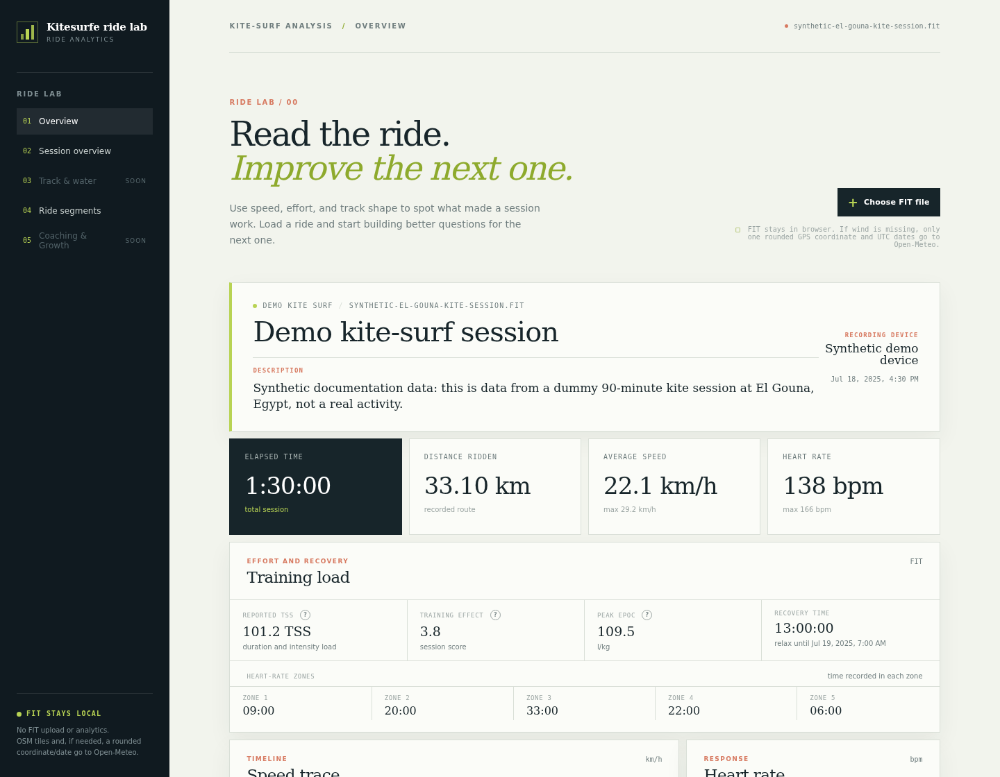
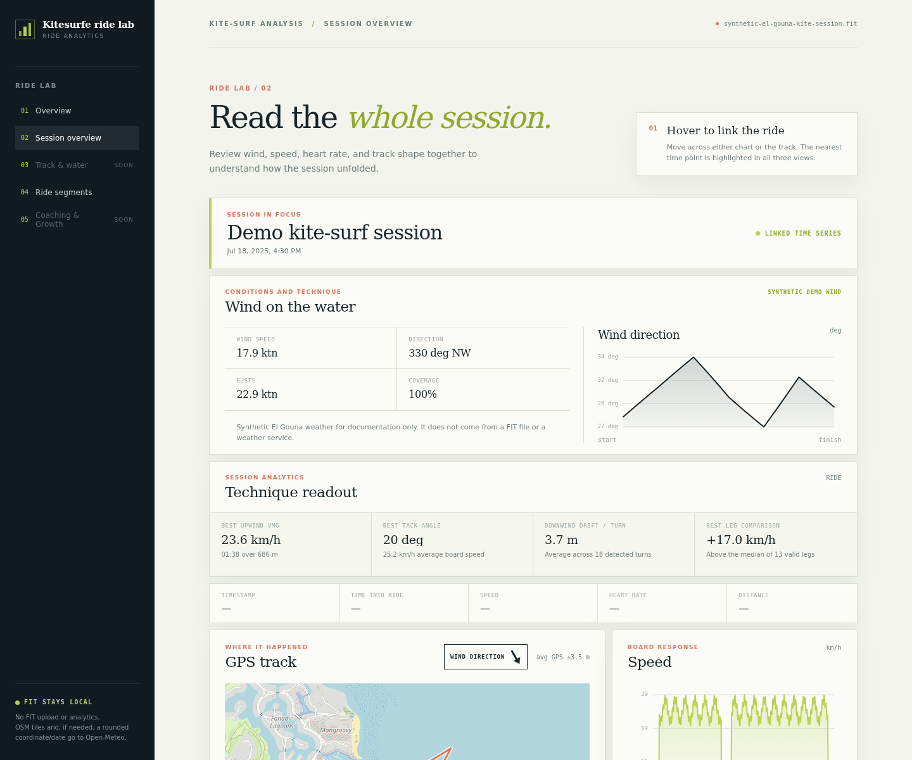
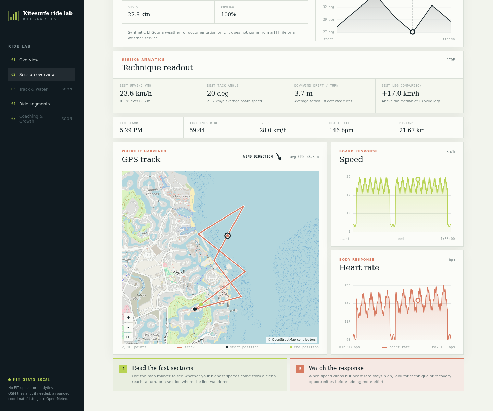
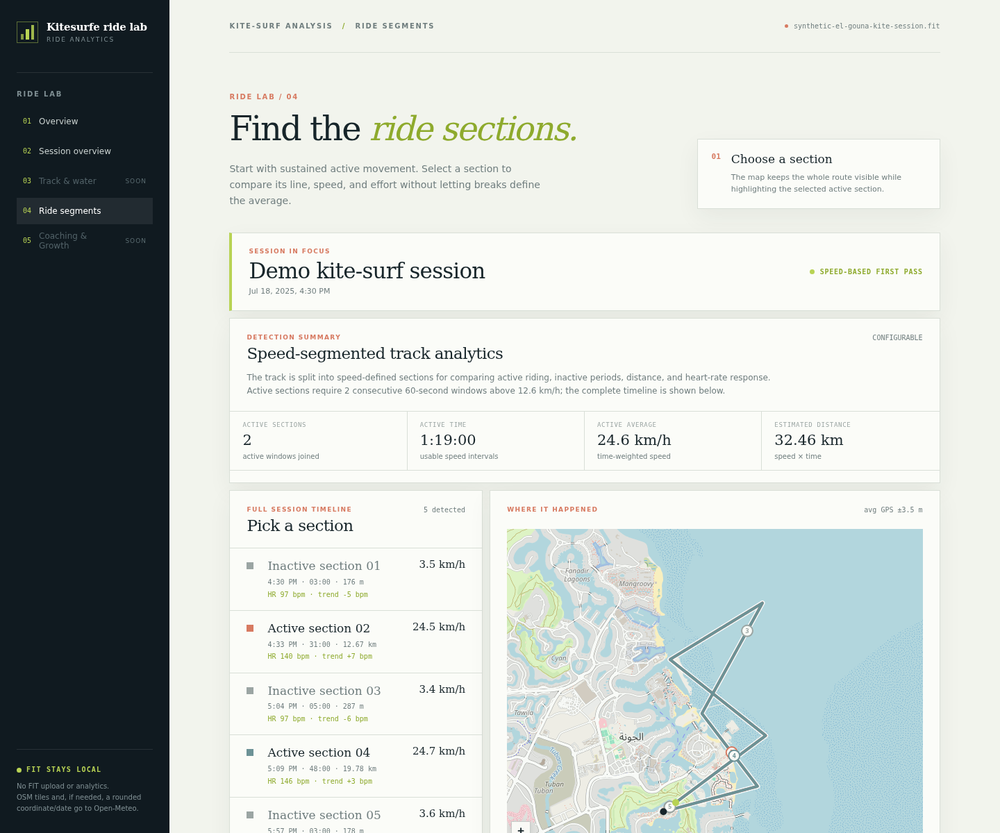

# FIT field notes

A local dashboard for exploring a Suunto Sport `.fit` export. It was designed and tested with Suunto `.fit` files, but should generally work with `.fit` exports from other manufacturers as well.

## Screenshots

All screenshots below use entirely synthetic data, not values from `sample_data/` or any real rider. They show a fictional 90-minute kite session at El Gouna, Egypt, with fabricated summer-style NNW wind around 18 kt and gusts around 23 kt. The in-app description and session title identify the data as a demo.

### Overview



### Session overview



### Session overview interaction

The linked cursor selection updates the speed and heart-rate graphs, map marker, and shared session readout together.



### Ride segments



## Privacy

- Your selected FIT file is decoded, analysed, and rendered entirely in the browser. It is never uploaded to this app or its server.
- The FIT file and derived activity data are held only in the current page's memory. The app does not write them to local storage, IndexedDB, cookies, or an account. Reloading or closing the tab clears the current activity.
- When a GPS track is visible, your browser requests the required OpenStreetMap tiles directly. OpenStreetMap receives those tile requests, not the FIT file or a separately uploaded route.
- If saved wind data is absent or incomplete, the app may request Open-Meteo historical weather using one representative GPS coordinate rounded to two decimal places and the session's UTC start/end dates. It never sends the FIT file or full GPS track; the returned weather annotation remains in browser memory.
- The app has no analytics or activity-data upload service.

## Run

Install Node.js 18 or newer, then run:

```bash
npm run app
```

Open <http://127.0.0.1:4173>. Use **Choose FIT file** or drag a file into the panel. To use another port:

```bash
npm run app -- --port 4174
```

The decoder validates FIT header and file CRCs, understands standard FIT definitions, compressed timestamps, FIT scaling, GPS/speed/heart-rate fields, standard weather conditions, and Suunto developer-field descriptions. The overview draws a downsampled GPS track over OpenStreetMap tiles and expands compact message sections with representative field values while leaving time-series values out. Unknown messages and fields remain in the parsed activity model so records, route, and sport-specific pages can be added without changing the import flow.

The dashboard first uses valid wind samples already saved in the FIT file. If they are absent or do not cover the whole timestamped session, it requests hourly wind speed, direction, and gust data from Open-Meteo's Historical Weather API. That request contains only one representative GPS coordinate rounded to two decimal places plus the UTC start/end dates, never the FIT file or full GPS track. Open-Meteo samples are interpolated locally as wind vectors, labelled as modelled data, and kept only in the browser's in-memory activity model.

OpenStreetMap's public tiles are free for reasonable use but are not an unlimited API. The map includes the required attribution and makes no analytics or FIT-data requests. Modelled weather includes Open-Meteo attribution in the dashboard.
